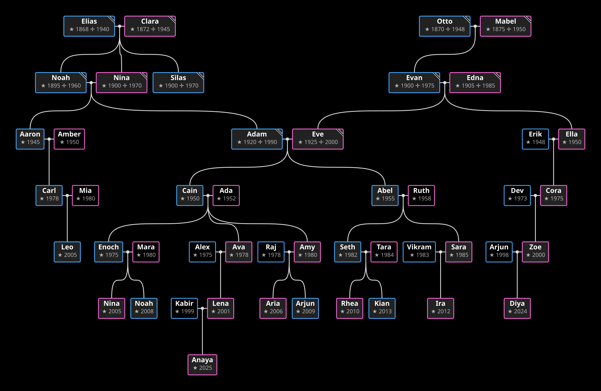

# GedcomGraphRS

Give it a GEDCOM file and it draws your family tree as an SVG. Pick anyone to start from.



## Usage

**SVG renderer:**

```bash
cargo run -- example.ged output.svg 4 I3
```

Args after the input file are the output path, the pixel scale (default 4), and the starting person id (default auto-picked). Leave off the output file for a text summary instead:

```bash
cargo run -- example.ged
```

**Tests:**

```bash
cargo test
cargo clippy --all-targets -- -D warnings
cargo fmt --check
```

## Library

```rust
let mut graph = Graph::with_gedcom(ged);
graph.max_ancestors(10).max_descendants(10);
graph.start_from(fulcrum);
measure_all(&mut graph, &fonts, &scale);
graph.init_nodes();
graph.place_nodes();
let svg = render_svg(&graph, &fonts, &scale, ox, oy, w, h);
```

No dependencies - standard library only. TrueType fonts load from the system at render time. `example.ged` is a 56-person tree across 7 generations; `demo.ged` is a smaller fixture.

## Credits

Original Java implementation by [michelesalvador](https://github.com/michelesalvador) - see [GedcomGraph](https://github.com/michelesalvador/GedcomGraph), [GedcomGraph-Canvas](https://github.com/michelesalvador/GedcomGraph-Canvas), and [FamilyGem](https://github.com/michelesalvador/FamilyGem).

## License

MIT - do whatever you want, see the repo license.
